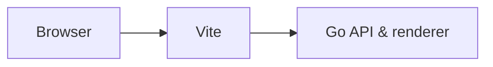
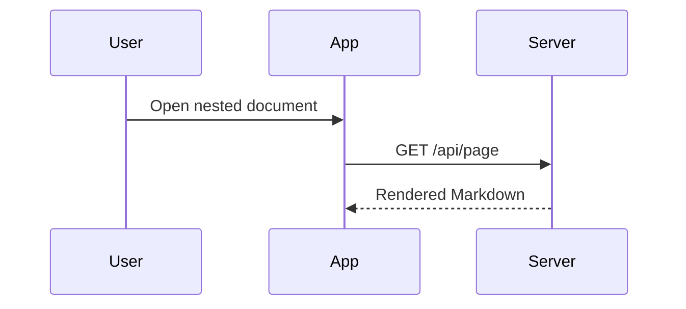
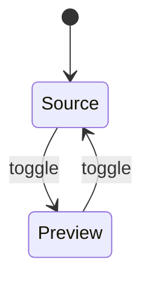
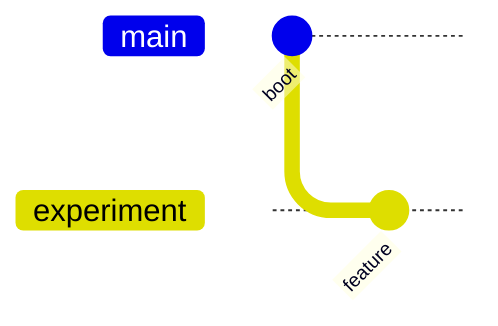

# Mermaid diagrams

## Request flow

```mermaid
flowchart LR
    Browser --> Vite
    Vite --> GoAPI["Go API & renderer"]
```

## Page load

```mermaid
sequenceDiagram
    participant User
    participant App
    participant Server
    User->>App: Open nested document
    App->>Server: GET /api/page
    Server-->>App: Rendered Markdown
```

## Document modes

```mermaid
stateDiagram-v2
    [*] --> Source
    Source --> Preview: toggle
    Preview --> Source: toggle
```

## Unsupported diagram fallback

```mermaid
gitGraph
    commit id: "boot"
    branch experiment
    checkout experiment
    commit id: "feature"
```
